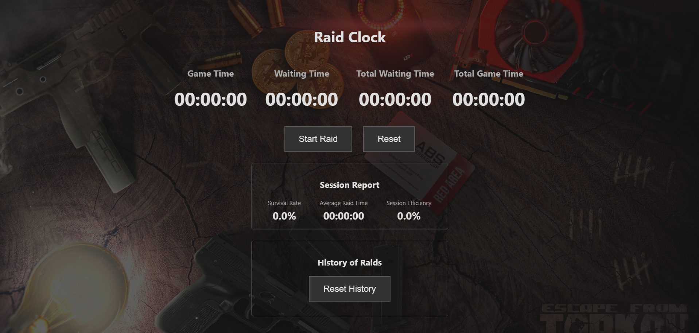

#  Tarkov Raid Clock 🕒

A single page web-application (SPA) designed to help *EFT*(Escape from Tarkov) players track down their game sessions, register each detail about each raid.

**[Live Demo](https://tarkov-raid-clock.vercel.app/)**
---

## 📜 Description

This project began as a simple timer to check how much time I was spending between play-time and waiting-time. After some changes it evolved into a complete analysis that stores the progress of each user locally and gives them usefull statistics.
It was a fun project to help me improve in my web application logic that I made from scratch.

---

## ✨ Features

* **Double Timer:** Timer for in-game time and waiting time.
* **Detailed Raid Logs:** Logs of each raid with information about survival and map.
* **Local Storage History :** Browser `localStorage` was used to store every raid statistics and allowing each session to be resumed.
* **Stats Dashboard:** 
    * Survival Rate (%)
    * Average Raid Time
    * Session Effiency 

---

## 🛠️ Tech Stack

* **HTML5:** Structure and syntax
* **CSS3:** Style, layout (Flexbox) and responsive design.
* **JavaScript (ES6+):** Backend purpose, DOM manipulation, events and state management.

---

## 🛣️ Roadmap

This project will shift now to a more focused side on Cloud and Cybersecurity. With some new features:

* **Backend e Authentication:** Migrate the data from the `localStorage` to a new cloud database with a login system for users, but still maintaing the option to be a "guest" and still use the app.
* **Secure Deployment:** Configure a customized domain with HTTPS, API keys management with Environment Variables and using Security Headers such as Content-Security-Policy (CSP).
* **Logging and Monitorization:** Create Cloud Functions to generate a log and send them to an alert activity about the app.

---

Made by JoaoBett.